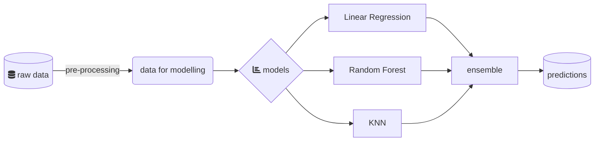

# Documentation example

```mermaid
graph TD;
    A-->B;
    A-->C;
    B-->D;
    C-->D;
```

``` mermaid
graph LR
    id1[(fa:fa-database raw data)] -->|pre-processing| B(data for modelling)
    B --> C{fa:fa-chart-bar models}
    C --> D[Linear Regression]
    C --> E[Random Forest]
    C --> F[KNN]
    D --> G[ensemble]
    E --> G
    F --> G
    G --> id2[(predictions)]
```

